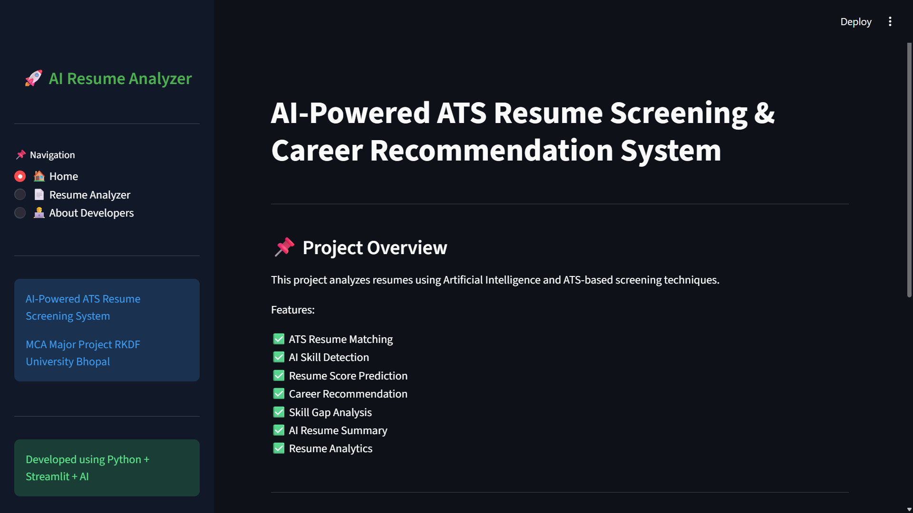
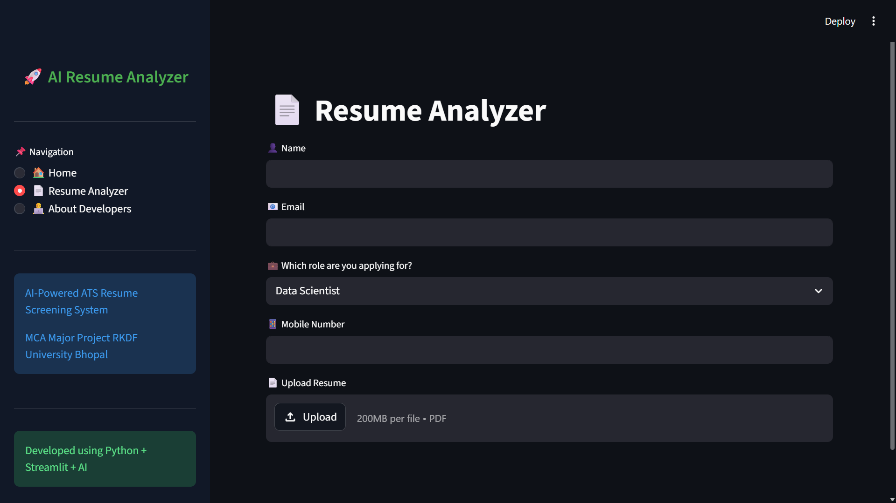
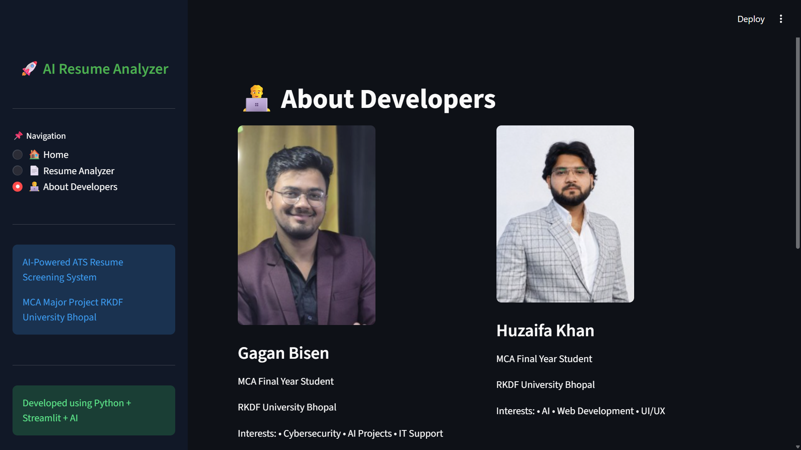

# 🚀 AI-Powered ATS Resume Screening & Career Recommendation System

## 📌 MCA Major Project

Developed By:

- Gagan Bisen
- Huzaifa Khan

RKDF University Bhopal

---

# 🎥 Project Demo Video

[](https://youtu.be/qaN61wu4aSs)

▶ Full Project Demonstration Video:  
https://youtu.be/qaN61wu4aSs

---

# 📖 Project Overview

The AI-Powered ATS Resume Screening & Career Recommendation System is an intelligent resume analysis application developed using Python and Streamlit.

The system analyzes uploaded resumes using ATS-based screening techniques and AI-driven skill analysis to provide:

- Resume Score
- ATS Compatibility Score
- Skill Detection
- Missing Skill Analysis
- Career Recommendations
- Resume Improvement Suggestions
- AI Resume Summary
- Resume Analytics

This project helps students and job seekers improve their resumes according to industry ATS standards.

---

# ✨ Features

## ✅ ATS Resume Matching
Analyzes resume according to selected job role requirements.

## ✅ AI Skill Detection
Automatically detects technical and professional skills from resumes.

## ✅ Resume Score Prediction
Generates a score out of 100 based on resume quality.

## ✅ Career Recommendation
Predicts suitable career field according to resume skills.

## ✅ Skill Gap Analysis
Identifies missing skills required for selected job role.

## ✅ AI Resume Summary
Generates intelligent summary of candidate profile.

## ✅ Resume Analytics
Shows graphical analysis using charts and visualizations.

## ✅ Resume Validation
Detects whether uploaded PDF is a valid resume.

## ✅ Modern User Interface
Professional sidebar navigation and responsive layout.

---

# 🛠 Technologies Used

| Technology | Purpose |
|---|---|
| Python | Backend Logic |
| Streamlit | Web Interface |
| NLP | Resume Text Processing |
| Plotly | Data Visualization |
| PDFMiner | PDF Resume Reading |
| spaCy | Skill Detection |
| pyresparser | Resume Parsing |
| Pandas | Data Handling |

---

# 📂 Project Structure

```bash
AI-Resume-Analyzer/
│
├── App.py
├── Courses.py
├── requirements.txt
├── README.md
├── photo1.jpg
├── photo2.jpg
│
├── Uploaded_Resumes/
│
└── venv/
```

---

# ⚙️ System Requirements

## Recommended Configuration

- Windows 10/11
- Python 3.10
- 8GB RAM
- Internet Connection

---

# 🔧 Complete Step-by-Step Setup Tutorial

---

# STEP 1 — Install Python

Download Python 3.10:

https://www.python.org/downloads/release/python-3100/

During installation:

✅ Enable:

```bash
Add Python to PATH
```

After installation verify:

```powershell
python --version
```

Expected:

```bash
Python 3.10.x
```

---

# STEP 2 — Download Project

Download project ZIP or clone repository.

Extract project folder.

Example folder:

```bash
AI-Resume-Analyzer
```

---

# STEP 3 — Open PowerShell

Open PowerShell inside project folder.

Example:

```powershell
cd "C:\Users\YourName\Desktop\AI-Resume-Analyzer"
```

---

# STEP 4 — Create Virtual Environment

Run:

```powershell
python -m venv venv
```

---

# STEP 5 — Activate Virtual Environment

Run:

```powershell
.\venv\Scripts\Activate.ps1
```

If PowerShell blocks execution:

Run:

```powershell
Set-ExecutionPolicy RemoteSigned -Scope CurrentUser
```

Then activate again:

```powershell
.\venv\Scripts\Activate.ps1
```

Successful activation looks like:

```powershell
(venv) PS C:\AI-Resume-Analyzer>
```

---

# STEP 6 — Install Project Dependencies

Run:

```powershell
pip install -r requirements.txt
```

Wait until installation completes.

---

# STEP 7 — Install spaCy Language Model

Run:

```powershell
python -m spacy download en_core_web_sm
```

This installs NLP model required for resume analysis.

---

# STEP 8 — Run Application

Run:

```powershell
python -m streamlit run App.py
```

OR

```powershell
streamlit run App.py
```

---

# STEP 9 — Open Browser

Application automatically opens in browser.

Default URL:

```bash
http://localhost:8501
```

---

# 📸 Adding Developer Images

Place these images inside project folder:

```bash
photo1.jpg
photo2.jpg
```

## Image Mapping

| File Name | Developer |
|---|---|
| photo1.jpg | Gagan Bisen |
| photo2.jpg | Huzaifa Khan |

---

# 📊 Functional Modules

## 1. Resume Upload Module
Allows users to upload PDF resumes.

## 2. Resume Parsing Module
Extracts text and important information from resume.

## 3. ATS Analysis Module
Matches resume against selected job role.

## 4. Skill Detection Module
Identifies technical and professional skills.

## 5. Resume Scoring Module
Calculates ATS and resume scores.

## 6. Recommendation Module
Provides courses and improvement suggestions.

## 7. Visualization Module
Displays graphical analysis using charts.

---

# 💼 Supported Job Roles

- Data Scientist
- Web Developer
- Cybersecurity Analyst
- Android Developer
- Cloud Engineer
- IT Support Engineer
- NOC Engineer
- Software Developer
- AI Engineer

---

# 📈 Future Enhancements

- AI Interview Preparation
- Resume Builder
- Online Deployment
- Multi-language Resume Support
- Database Integration
- Admin Dashboard
- Authentication System

---

# 🧠 Learning Outcomes

Through this project we learned:

- Artificial Intelligence Concepts
- ATS Resume Screening
- Python Application Development
- NLP-based Resume Analysis
- Streamlit UI Development
- Data Visualization
- Resume Parsing Techniques

---

# 🚀 How the System Works

## Step 1
User uploads resume PDF.

## Step 2
System extracts resume text.

## Step 3
Skills and information are detected.

## Step 4
ATS analysis compares skills with selected role.

## Step 5
Resume score and recommendations are generated.

## Step 6
Graphs and analytics are displayed.

---

# 📷 Screenshots

## 🏠 Home Page



---

## 📄 Resume Analysis Dashboard




## About 



# 📌 Important Commands

## Install Requirements

```powershell
pip install -r requirements.txt
```

## Run Project

```powershell
python -m streamlit run App.py
```

## Create Requirements File

```powershell
pip freeze > requirements.txt
```

## Activate Virtual Environment

```powershell
.\venv\Scripts\Activate.ps1
```

---

# ❗ Common Errors & Solutions

## PowerShell Execution Error

Solution:

```powershell
Set-ExecutionPolicy RemoteSigned -Scope CurrentUser
```

---

## streamlit not recognized

Solution:

```powershell
python -m streamlit run App.py
```

---

## spaCy model missing

Solution:

```powershell
python -m spacy download en_core_web_sm
```

---

## Missing packages

Solution:

```powershell
pip install -r requirements.txt
```

---

# 👨‍💻 Developers

## Gagan Bisen

MCA Final Year Student  
RKDF University Bhopal

Interests:
- Cybersecurity
- AI Projects
- IT Support

---

## Huzaifa Khan

MCA Final Year Student  
RKDF University Bhopal

Interests:
- Artificial Intelligence
- Web Development
- UI/UX Design

---

# 📄 License

This project is developed for educational and academic purposes only.

---

# ⭐ Conclusion

The AI-Powered ATS Resume Screening & Career Recommendation System successfully demonstrates how Artificial Intelligence and NLP techniques can be used to analyze resumes intelligently and provide career recommendations.

The project helps candidates optimize resumes according to industry ATS standards and improve employability.

---
